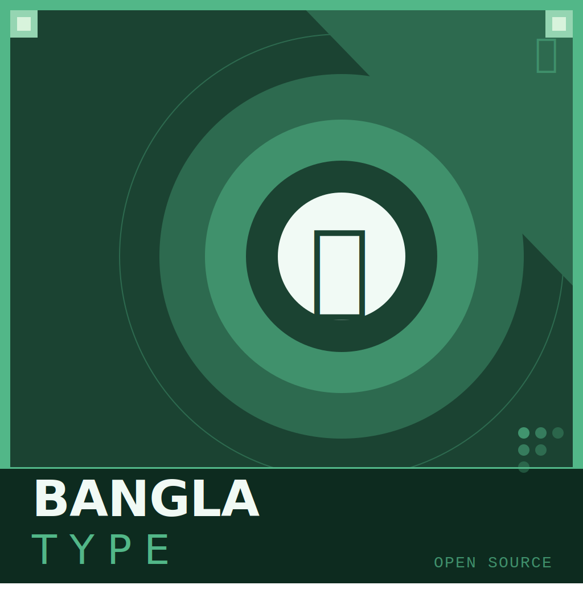

# বাংলা কীবোর্ড — **BanglaType** for macOS

<p align="center">
  
</p>

<p align="center">
  <strong>A free, open-source Bangladeshi Bangla input method for macOS</strong><br/>
  Swift & SwiftUI · InputMethodKit · Made for Bangladesh 🇧🇩
</p>

<p align="center">
  <a href="https://github.com/nafiskabbo/bangla-type/releases"></a>
  <a href="LICENSE"></a>
  <a href="https://github.com/nafiskabbo/bangla-type/stargazers"></a>
  
</p>

---

## What is BanglaType?

**BanglaType** lets you type **Bangladeshi Bangla** (বাংলাদেশ প্রমিত বাংলা) on your Mac using:

- **Avro Phonetic** — type in Roman script (e.g. `amar` → আমার)
- **7 fixed layouts** — Probhat, Munir Optima, National (Jatiya), and more

See [Features](docs/FEATURES.md) and [Keyboard layouts](docs/KEYBOARD_LAYOUTS.md) for details.

---

## 📥 How to install

### Step 1 — Get the app

**Option A — Download DMG (easiest)**  
1. Go to [**Releases**](https://github.com/nafiskabbo/bangla-type/releases).  
2. Download the latest **BanglaType-x.x.x.dmg**.  
3. Open the DMG.  
4. Drag **BanglaType.app** onto the **“Install to Input Methods”** shortcut (or copy it to `/Library/Input Methods/` yourself).  
   - You **must** use **`/Library/Input Methods/`** (the main Library folder, not the one in your home folder).  
   - Your Mac may ask for your password.

**Option B — Homebrew**  
```bash
brew install --cask banglatype
```
*(After the first release is published; the cask points to this repo.)*

**Option C — Build from source**  
See [Building](docs/BUILDING.md).

---

### Step 2 — Log out and back in

macOS only loads new input methods at login.  
**Log out of your account and log back in** (or restart your Mac).  
If you skip this, BanglaType will **not** show up in the input list.

---

### Step 3 — Add BanglaType as an input source

1. Open **System Settings** (or **System Preferences**).  
2. Go to **Keyboard** → **Input Sources** (or **Input Methods**).  
3. Click the **+** button.  
4. Search for **“Bangla”** or scroll to find **BanglaType**.  
5. Select **BanglaType** and click **Add**.

---

### Step 4 — Start typing

- Click the **input menu** in the menu bar (e.g. “ABC” or a flag) and choose **BanglaType**.  
- You should see a **বাং·অভ্র** (or similar) icon — click it to change layout or open **Preferences**.

---

## ❓ Keyboard not showing?

If **BanglaType** doesn’t appear in **System Settings → Keyboard → Input Sources**:

1. **Right place?** The app must be in **`/Library/Input Methods/BanglaType.app`** (not `~/Library`).  
2. **Logged out and in?** You must log out and log back in (or restart) after installing.  
3. **Quit and try again:** In Terminal run `killall BanglaType`, then copy the app to `/Library/Input Methods/` again and log out/in.  
4. **macOS version:** You need **macOS 13 (Ventura)** or later.

---

## ⌨️ Quick use

- **Avro:** Select BanglaType, then type in Roman letters (e.g. `bangladesh` → বাংলাদেশ).  
- **Layouts:** Click the menu bar icon (বাং·…) → choose Avro Phonetic, Probhat, etc.  
- **Preferences:** Menu bar icon → **Preferences…** or press **⌃ Control + ,**.  
- **Shortcuts:** See [Shortcuts](docs/SHORTCUTS.md).

---

## Documentation

| Link | Description |
|------|-------------|
| [Changelog](CHANGELOG.md) | Version history and release notes |
| [Features](docs/FEATURES.md) | Full feature list |
| [Keyboard layouts](docs/KEYBOARD_LAYOUTS.md) | All 7 layouts |
| [Shortcuts](docs/SHORTCUTS.md) | Keyboard shortcuts |
| [Building](docs/BUILDING.md) | Build from source, DMG, dictionary |

---

## Releases and DMG

- **Releases:** [github.com/nafiskabbo/bangla-type/releases](https://github.com/nafiskabbo/bangla-type/releases)  
- Release notes and version history are in **[CHANGELOG.md](CHANGELOG.md)**.  
- When we push a **tag** like `v1.0.0` (or run the **Release** workflow from the Actions tab with that tag), GitHub Actions builds the app and attaches a **DMG** to that release.  
- You can download the DMG from the Releases page and install as in Step 1 above.

---

## Contributing

We welcome contributions. Please read **[CONTRIBUTING.md](CONTRIBUTING.md)** before sending a pull request.

---

## Credits & license

- **License:** [GPL-3.0](LICENSE)  
- **Thanks to:** Avro Keyboard (OmicronLab), OpenBangla Keyboard, and all Bangladeshi layout authors.

---

<p align="center">
  বাংলাদেশের জন্য, বাংলাদেশিদের দ্বারা তৈরি ❤️ 🇧🇩
</p>

<p align="center">
  <strong>With love from <a href="https://www.ruet.ac.bd/">Rajshahi University of Engineering & Technology (RUET)</a></strong> 🎓
</p>
